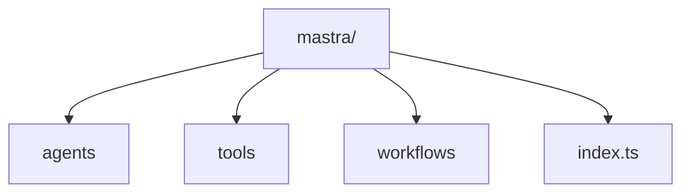

> #### *This guide walks you through Mastra's components, showing how to quickly spin-up fully-functional agents — loaded with customizable tools and a modular workflow. You will learn how to launch a local dashboard, which includes an agent playground, Mastra’s API, Open API docs, and Swagger UI .*


# Introduction and Overview

**Our objective is to deliver a solution that helps developers quickly create AI agents and workflows.** This toolkit simplifies development and enhances AI capabilities, making it easier to integrate AI components so developers can focus on innovation.

We aim to make this toolkit accessible and user-friendly for both beginners and experienced professionals. Below is our final product, which we encourage you to remix into your own (details in `Concluding Remarks`).


## Framework and Design

We aim to streamline the development of AI agents and workflows by providing a user-friendly and accessible toolkit for developers. The diagram below illustrates the elegant simplicity of our template.



```markdown
mastra-starter/
├── src/
│   └── mastra/
│       ├── agents/           # AI agent definitions
│       ├── tools/            # Custom tools for agents
│       ├── workflows/        # Multi-step workflows
│       └── index.ts          # Main Mastra configuration
├── package.json              # Project dependencies
├── tsconfig.json             # TypeScript configuration
└── .env.example              # Environment variables template
```

# Mastra Framework

## I. Agents Component

> **Agents in Mastra are AI-powered entities that leverage LLMs to perform tasks.** These are intelligent entities powered by advanced Large Language Models (LLMs). Agents are designed to perform specific tasks with precision and efficiency. They can process natural language inputs, make decisions, and execute actions based on the data they receive.

We include a `weatherAgent` implementation in the starter kit to demonstrate Mastra’s native capabilities. You can configure agents with: a descriptive name, detailed instructions that guide its behavior, integration with OpenAI's GPT-4o model, and access to the custom `weatherTool`.

### SK Agents Implementation

By leveraging the power of LLMs, these agents can handle a wide range of tasks, from simple queries to complex problem-solving scenarios. Developers can define and customize these agents to suit the unique needs of their applications, ensuring that each agent is tailored to perform its designated role effectively.

```typescript
// src/mastra/agents/index.ts
import { openai } from '@ai-sdk/openai';
import { Agent } from '@mastra/core/agent';
import { weatherTool } from '../tools';

export const weatherAgent = new Agent({
  name: 'Weather Agent',
  instructions: `
      You are a helpful weather assistant that provides accurate weather information.

      Your primary function is to help users get weather details for specific locations. When responding:
      - Always ask for a location if none is provided
      - If giving a location with multiple parts (e.g. "New York, NY"), use the most relevant part (e.g. "New York")
      - Include relevant details like humidity, wind conditions, and precipitation
      - Keep responses concise but informative

      Use the weatherTool to fetch current weather data.
  `,
  model: openai('gpt-4o'),
  tools: { weatherTool },
});
```

## II. Tools Component

> **Tools are the functional components that enhance the capabilities of the agents.** They provide specialized functionalities that agents can utilize to perform their tasks more effectively. The starter kit includes a weather tool that fetches data from an external API, but that is only one of many options.

Tools range from data processing utilities to integration modules that connect with external APIs or databases. *By incorporating tools, developers can extend the functionality of agents*, enabling them to interact with various systems and perform complex operations. This modular approach scales and adapts with ease as new tools can be added or existing ones modified without disrupting the overall system.

### SK Tools Implementation

**Our implementation showcases**: schema validation using Zod for both input and output, structured error handling, integration with external APIs (Open-Meteo), and type safety throughout the execution flow.

```typescript
// src/mastra/tools/weather.ts
export const weatherTool = createTool({
  id: 'get-weather',
  description: 'Get current weather for a location',
  inputSchema: z.object({
    location: z.string().describe('City name'),
  }),
  outputSchema: z.object({
    temperature: z.number(),
    feelsLike: z.number(),
    humidity: z.number(),
    windSpeed: z.number(),
    windGust: z.number(),
    conditions: z.string(),
    location: z.string(),
  }),
  execute: async ({ context }) => {
    return await getWeather(context.location);
  },
});
```

## III. Workflows Component

> Workflows define the actions to achieve a goal, coordinating agents and tools for smooth data flow. This allows devs to create advanced AI applications for complex tasks.

Workflows break down problems into manageable steps, improving code clarity and maintainability. These components help developers build powerful AI applications with clear separation of concerns and maintainable code using TypeScript.

### SK Workflow Example

**We incorporate an example containing a weather workflow**. We take a city `name`, fetch weather data using the `fetchWeather` step, generate activity recommendations based on the forecast using the `planActivities` step, and finalize the workflow with `commit()`.

```typescript
// src/mastra/workflows/index.ts
const weatherWorkflow = new Workflow({
  name: 'weather-workflow',
  triggerSchema: z.object({
    city: z.string().describe('The city to get the weather for'),
  }),
})
  .step(fetchWeather)
  .then(planActivities);

weatherWorkflow.commit();
```

### Workflow Registration

Each step in the workflow is defined with its own input schema, execution logic, and error handling. This central registration: organize and centralizes components, integrates logging for debugging and monitoring, and enable easy access to all workflows and agents throughout the application.

```typescript
// Example of the fetchWeather step from workflows/index.ts
const fetchWeather = new Step({
  id: 'fetch-weather',
  description: 'Fetches weather forecast for a given city',
  inputSchema: z.object({
    city: z.string().describe('The city to get the weather for'),
  }),
  execute: async ({ context }) => {
    // Implementation details...
    return forecast;
  },
});

// src/mastra/index.ts
import { Mastra } from '@mastra/core/mastra';
import { createLogger } from '@mastra/core/logger';
import { weatherWorkflow } from './workflows';
import { weatherAgent } from './agents';

export const mastra = new Mastra({
  workflows: { weatherWorkflow },
  agents: { weatherAgent },
  logger: createLogger({
    name: 'Mastra',
    level: 'info',
  }),
});
```

> #### **TypeScript Integration**

```json
// package.json (dependencies)
{
  "dependencies": {
    "@ai-sdk/openai": "^1.2.5",
    "@mastra/core": "^0.6.0",
    "mastra": "^0.3.1",
    "zod": "^3.24.2"
  },
  "devDependencies": {
    "@types/node": "^22",
    "tsx": "^4.19.3",
    "typescript": "^5.8.2"
  }
}
```

> #### Schema Validation with Zod

```typescript
// Example from workflows/index.ts
const forecastSchema = z.array(
  z.object({
    date: z.string(),
    maxTemp: z.number(),
    minTemp: z.number(),
    precipitationChance: z.number(),
    condition: z.string(),
    location: z.string(),
  }),
);
```

> #### Development Environment

```json
// package.json (scripts)
{
  "scripts": {
    "dev": "mastra dev"
  }
}
```

# Step-by-Step Guide

<div data-node-type="callout">
<div data-node-type="callout-emoji">⛓</div>
<div data-node-type="callout-text"><a target="_self" rel="noopener noreferrer nofollow" href="https://github.com/BunsDev/mastra-starter" style="pointer-events: none">github.com/BunsDev/mastra-starter</a></div>
</div>

[](https://github.com/BunsDev/mastra-starter)

```bash
# Clones Template
git clone https://github.com/BunsDev/mastra-starter.git
cd mastra-starter
```

```bash
# Setup Environment Variables
cp .env.example .env

# Add your OpenAI API Key
OPENAI_API_KEY=<YOUR_OPENAI_API_KEY>
&& source .env
```

```bash
# Installs Dependences
yarn

# Launches Dashboard
yarn dev
```


## Dashboard Features

<div data-node-type="callout">
<div data-node-type="callout-emoji">🧠</div>
<div data-node-type="callout-text">Contains a chat interface for agent interaction, workflow visualization tools, debug information, logs, and performance metrics.</div>
</div>

### Playground Interface

[localhost:4111](http://localhost:4111) — space for experimenting with new ideas and testing integrations. It is an essential feature for developers looking to innovate and push the boundaries of what the application can achieve.

### Mastra API

[/api](http://localhost:4111/api) — backbone providing a robust interface for interacting with various components. The API allows developers to seamlessly integrate and extend functionalities.

### Open API Documentation

[/openapi.json](http://localhost:4111/openapi.json) — offers insights into the API's capabilities, enabling developers to understand and utilize the available endpoints effectively. This documentation is crucial for ensuring that all team members are on the same page regarding the API's usage and potential.

### Swagger UI

[/swagger-ui](http://localhost:4111/swagger-ui) — more interactive experience, the Swagger UI provides a user-friendly interface to explore and test API endpoints. This tool is invaluable for developers who need to verify the behavior of the API in a controlled environment, allowing for quick iterations and debugging.

# Concluding Remarks

Congratulations! You have successfully setup your foundation for developing advanced applications with AI integration. Our template offers flexibility and tools for your to build custom, innovative solutions.

As AI technology progresses, frameworks like Mastra deliver the architectural patterns and development tools necessary to effectively leverage these advancements.

The starter kit acts as an educational resource and practical template for applications. For further details, visit Mastra's official website or explore the documentation for in-depth guides and examples.

## Bonus Challenge

**Extend the template by customizing it to fit your specific use case.** By tailoring the template to your use case, you not only create a solution that is perfectly aligned with your goals but also gain valuable insights into the capabilities and potential of AI integration.

%[https://github.com/BunsDev/mastra-starter] 

> This exercise will enhance your understanding of both the template and the broader landscape of AI development, preparing you for future projects and challenges.

To extend the template, developers can customize new agents with specialized skills and build tools that integrate with external APIs, enhancing functionality. Designing workflows for complex tasks ensures efficient execution. Lastly, improving the UI creates a tailored user experience by customizing the dashboard and other elements.

Do any of the following, then screenshot and share your code in a tweet and we will share it  
— *just be sure to include @* [*DeDevsClub*](https://x.com/DeDevsClub) *in your tweet!*

* **Create New Agents**: Define additional agents with specialized capabilities.
    
* **Build Custom Tools**: Develop tools that integrate with external APIs or services.
    
* **Design Workflows**: Create multi-step processes for complex tasks.
    
* **Enhance the UI**: Customize the dashboard for specific application needs.
    
* **Submit an Issue on GitHub**: Details on how found in the [ISSUES\_TEMPLATE](https://github.com/BunsDev/mastra-starter/blob/main/.github/ISSUE_TEMPLATE/example-request.md)
    

---

# **About the Author &lt;3**


### **Valentina Alexander**

**Keep in Touch on Twitter @** [0xBuns](https://x.com/0xBuns)  
CoFounder of DeDevs @ [DeDevsClub](https://x.com/DeDevsClub)  
Developer Relations Engineer (DRE) @ [Chainlink Labs](https://chain.link)

---

# **Join DeDevs Online**

> In today’s tech-driven world, the fusion of blockchain and AI isn't just a trend—it's a revolution that's changing everything! As these groundbreaking technologies reshape industries, having a dedicated space where developers can connect, share insights, and collaborate is more crucial than ever.


> Checkout what George has to say about our community and features in the testimonial below.


> We created a community for professionals in Blockchain and Artificial Intelligence. Our platform connects experts, enthusiasts, and newcomers passionate about these technologies. Members collaborate on innovative projects that push the boundaries of what is possible.

%[https://dedevs.club]